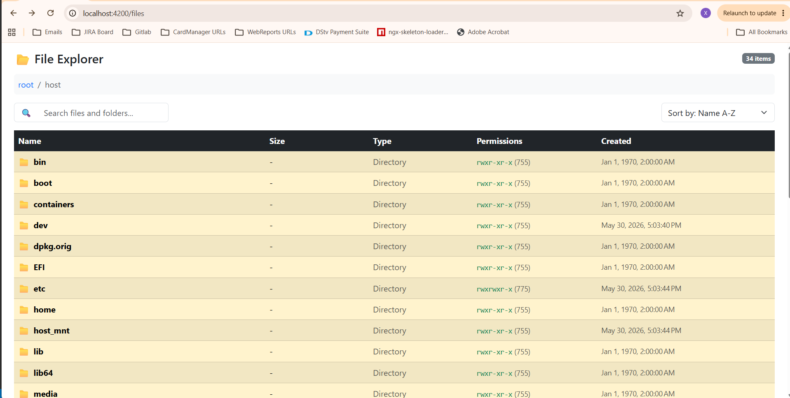

# Filesystem Assessment Application

## Overview

This project was developed as part of the JOBJACK technical assessment.

The solution consists of a containerized full-stack application built with NestJS and Angular. The application allows users to browse a mounted filesystem, navigate directories, inspect file metadata, and manage large directory structures through pagination and reactive UI updates.

* A NestJS backend API that exposes filesystem information from a mounted host directory.
* An Angular 21 frontend that allows users to browse directories, navigate through folders, search, sort, and view file metadata.
* Docker containerization to ensure the application can run consistently across different environments.

---

## Application Screenshot 



## Assessment Requirements Covered

### Backend API

The API provides:

* Directory listing for a given path
* File name
* Full path
* File size
* File extension / file type
* Created date
* File permissions
* Directory vs file identification
* Directory navigation support
* Pagination support for large directories

### Frontend Application

The Angular client provides:

* Responsive user interface
* Directory navigation
* Breadcrumb navigation
* Client-side search functionality
* Client-side Sorting functionality
* Pagination
* File metadata display

### Containerization

The application is fully containerized using Docker.

A host directory is mounted into the container and exposed under:

```text
/host
```

All filesystem operations are restricted to this mounted location.

---

## Architecture

### Frontend

The frontend follows a Feature-Based Architecture.

```text
src/app
├── core
│   ├── models
│   └── services
├── features
│   └── file-explorer
│       └── pages
│           └── file-explorer
└── shared
    ├── search
    └── sort-by

#### Core

Contains application-wide services and models.

#### Features

Contains business functionality grouped by domain.

#### Shared

Contains reusable UI components used across the application.

### Backend

The backend follows NestJS's modular architecture.

```text
src/filesystem
├── dto
├── interfaces
├── filesystem.controller.ts
├── filesystem.service.ts
└── filesystem.module.ts
```

Responsibilities are separated between:

* Controller layer
* Service layer
* DTO validation
* Shared interfaces

---

## Technical Decisions

### Large Directory Support

To support directories containing large numbers of files:

* Server-side pagination is implemented.
* Only the requested page is returned to the client.
* File metadata is processed in batches using controlled concurrency.
* Results are streamed through asynchronous operations instead of blocking the event loop.

### Security

To prevent path traversal and unauthorized filesystem access:

* Requests are restricted to paths starting with `/host`.
* Access outside the mounted volume is rejected.

### Reactive Programming

The frontend heavily uses RxJS:

* BehaviorSubject
* combineLatest
* switchMap
* shareReplay
* map
* catchError

Directory loading, searching, sorting and pagination state are managed reactively through RxJS streams instead of imperative event handling. This approach improves maintainability and aligns with the assessment recommendation to favour stream-based programming.

### API Choice

Although GraphQL was suggested in the assessment, REST was selected for this implementation because it provided a straightforward solution for the required filesystem navigation functionality while allowing focus on scalability, testing, and containerization.

---

## Technologies Used

### Frontend

* Angular 21
* TypeScript
* RxJS

### Backend

* NestJS
* Node.js
* TypeScript

### Infrastructure

* Docker
* Docker Compose

---

## Running the Application

### Step 1: Clone and select correct branch

After cloning the repository, switch to the correct working branch:

```bash
git clone https://github.com/Xholile/filesystem-assessment-application.git
git checkout dev

### Start with Docker

```bash
docker-compose up --build
```

Frontend:

```text
http://localhost:4200
```

Backend:

The backend exposes a REST API for filesystem navigation.

```text
Base URL:
http://localhost:3000

Primary endpoint:
http://localhost:3000/filesystem?path=/host&page=1&limit=50
```
Note: All filesystem access is restricted to /host for security reasons.

---

## Running Locally

### Backend

```bash
cd filesystem-backend
npm install
npm run start:dev
```

### Frontend

```bash
cd filesystem-client
npm install
ng serve
```

---

## Test Results

### Backend

✓ Filesystem Service Tests  
✓ Filesystem Controller Tests  
✓ Application Controller Tests

### Frontend

✓ Filesystem Service Tests  
✓ File Explorer Component Tests  
✓ Application Component Tests

All automated tests are currently passing.

### Backend

```bash
npm run test
```

Current Status:

* Service tests passing
* Controller tests passing

### Frontend

```bash
ng test
```

Current Status:

* Application tests passing
* Service tests passing
* Component tests passing

---

## API Endpoint

### GET /filesystem

Example:

```http
GET /filesystem?path=/host&page=1&limit=50
```

### Query Parameters

| Parameter | Description    |
| --------- | -------------- |
| path      | Directory path |
| page      | Page number    |
| limit     | Page size      |

### Response

```json
{
  "data": [],
  "total": 0,
  "page": 1,
  "limit": 50,
  "totalPages": 0
}
```

---

## Assumptions

* The host directory is mounted into the container as `/host`.
* Users may only browse directories within the mounted volume.
* Pagination defaults to 50 items per page.
* Directory navigation is performed through the API rather than direct filesystem access from the client.

---

## Future Improvements

* Infinite scrolling
* Virtualized lists for extremely large directories
* File previews
* Caching
* GraphQL implementation
* Authentication and authorization

---

## Author

Xholile Present